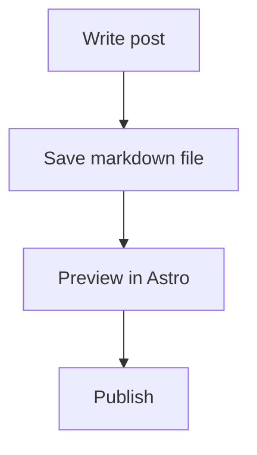

# Post Writing Template

Copy this into any new file in `src/content/posts`.

```md
---
title: Your post title
description: A short summary for the homepage, tags, archive, and SEO.
author: Junior Dev
publishedAt: 2026-04-06
updatedAt: 2026-04-06
tags:
  - notes
  - writing
readingTime: 4 min read
draft: false
featured: false
---

Write your opening paragraph here. The homepage excerpt is pulled from the first real paragraphs of the post.

## Text formatting

Use **bold**, *italics*, [links](https://example.com), and `inline code`.

You can also use wiki links like [[hello-terminal-world|an internal post link]].

## Lists

- unordered list item
- another item

1. ordered item
2. next item

- [x] completed task
- [ ] open task

## Plain quote

> This is a normal blockquote.

## Note

> [!NOTE] Optional note title
> This renders as a softer themed note block.

## Tip

> [!TIP] Optional tip title
> This renders as the inverse-style tip block.

## Hint

> [!HINT] Optional hint title
> This renders as the stronger callout panel.

## Code block

```ts
export function greet(name: string) {
    return `Hello, ${name}`;
}
```

## Mermaid diagram



## Table

| Feature | Supported |
| --- | --- |
| Mermaid | Yes |
| Wiki links | Yes |
| Raw HTML | Yes |

## Image embeds

Original size:

![[/icon.svg|Optional caption|original]]

Full width:

![[/icon.svg|Optional caption|full]]

## Raw HTML

<details>
  <summary>Expandable section</summary>
  <p>Raw HTML works inside posts too.</p>
</details>

## Video

<video controls width="100%" src="/videos/example.mp4"></video>
```

## Recommended fields

- `title`
- `description`
- `author`
- `publishedAt`
- `tags`
- `readingTime`
- `updatedAt`
- `draft`
- `featured`
