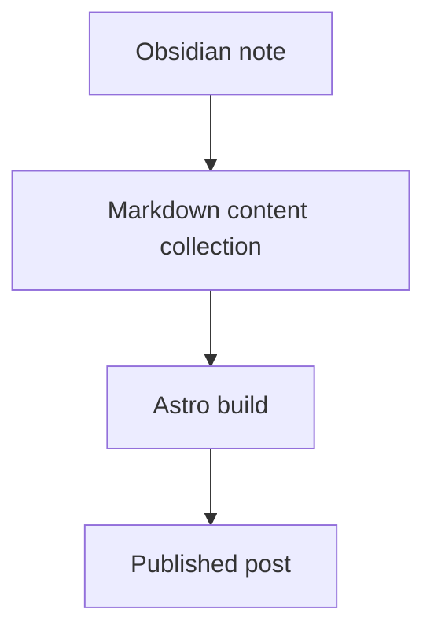

Welcome to the blog.

This site is built to feel like a clean, old-school developer notebook:

- markdown-first
- calm typography
- excellent code and image rendering
- quick scanning on desktop and mobile

> [!NOTE] Obsidian-friendly by default
> You can paste notes from Obsidian directly into this blog with Mermaid diagrams, callouts, raw HTML, and simple wiki
> links.

> Hello
> Hi

## Mermaid works

## Raw HTML is fine too

![[/icon.svg|A simple inlaid image|original]]

You can also use wiki links like [[shipping-fast-with-calm-systems|related posts]] or image embeds like
`![[/images/diagram.png]]`.
