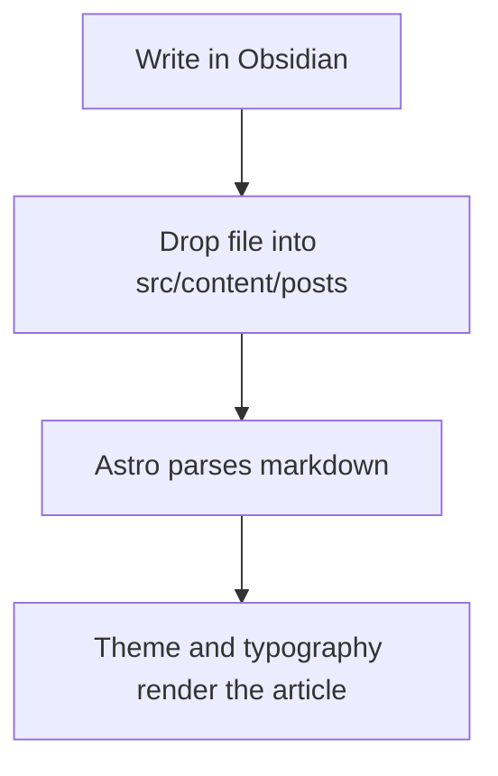
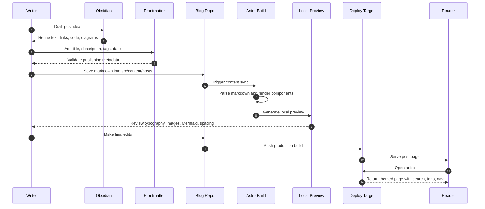

This post is a working reference for the writing features supported by the blog. It covers normal markdown,
Obsidian-style links and embeds, Mermaid diagrams, code blocks, and the custom callout styles.

If you just want to start writing, copy the `templates/post-template.md` structure into a new file and begin there.

## Paragraphs and inline formatting

You can write plain paragraphs, mix in **bold text**, *italic text*, and add `inline code` anywhere it helps.

Links render normally too, including standard markdown links like [Astro](https://astro.build/) and wiki links
like [[hello-terminal-world|Hello, terminal world]].

## Lists and tasks

- unordered lists work well
- they keep the same calm article rhythm
- and they are easy to scan

1. Ordered lists work too.
2. They are useful for step-by-step notes.
3. They render with the same mono reading style.

- [x] Draft the note
- [x] Add metadata
- [ ] Publish the next post

## Block quotes and callouts

> A plain quote stays simple.
> It uses the normal quote style with the softer left rule.

> [!NOTE] Notes look like calm quotes
> Notes use the themed surface background and a stronger left rule, but they still feel close to a normal markdown
> quote.

> [!TIP] Tips invert the note treatment
> Tips use a darker background with lighter text so they stand apart a bit more.

> [!HINT] Hints keep the more classic callout look
> Hints still render as a more explicit panel when you want a stronger visual cue.

## Code blocks

```ts
type PostMeta = {
    title: string;
    publishedAt: string;
    tags: string[];
};

export function summarize(meta: PostMeta) {
    return `${meta.title} ships on ${meta.publishedAt} with ${meta.tags.length} tags.`;
}
```

```bash
npm install
npm run dev
npm run build
```

```json
{
  "title": "junior.log",
  "stack": "astro",
  "content": "markdown"
}
```

## Mermaid diagrams





## Tables

| Feature      | Supported | Notes                                          |
|--------------|-----------|------------------------------------------------|
| Mermaid      | Yes       | Theme-aware and scrollable for larger diagrams |
| Wiki links   | Yes       | `[[slug                                        |Label]]` syntax |
| Image embeds | Yes       | `original` and `full` sizing                   |
| Raw HTML     | Yes       | Useful for custom layout details               |

## Images and embeds

Here is an original-size Obsidian-style image embed:

![[/icon.svg|Original-size image embed|original]]

And here is the same asset rendered full width:

![[/icon.svg|Full-width image embed|full]]

## Raw HTML

<details>
  <summary>Expandable note</summary>
  <p>You can drop in small bits of raw HTML when markdown alone is not enough.</p>
</details>

<figure>
  
  <figcaption>Raw HTML also works inside the post body.</figcaption>
</figure>

## Related writing

If you want to compare styles, jump to [[shipping-fast-with-calm-systems|Shipping fast with calm systems]] or back
to [[hello-terminal-world|Hello, terminal world]].
