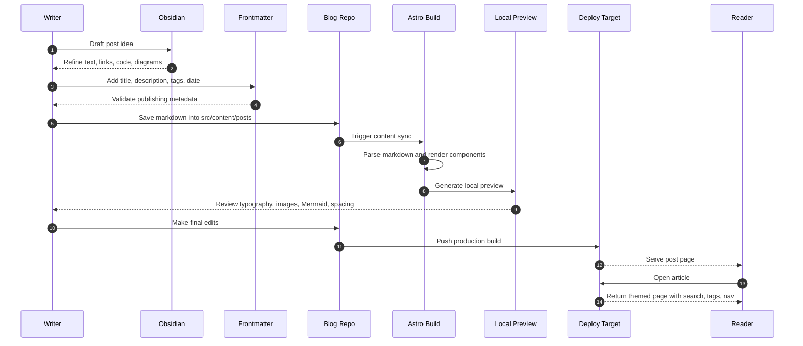

The goal is not maximum speed.

The goal is **repeatable speed**.

> [!TIP] A publishing system should reduce friction, not add ceremony.
> If writing a post feels heavier than writing the note itself, the workflow needs work.

## Working rule

1. Write in Obsidian.
2. Add frontmatter.
3. Drop the file into `src/content/posts`.
4. Ship.

## Sequence view



```ts
export function publish(post: { title: string; publishedAt: Date }) {
    return `${post.title} shipped on ${post.publishedAt.toISOString()}`;
}
```
