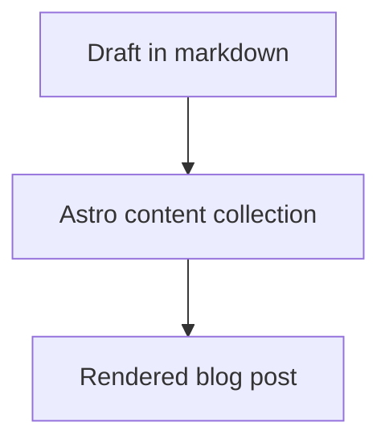

Write your opening paragraph here.

## Text formatting

Use **bold**, *italics*, [links](https://example.com), and `inline code`.

## Code block

```ts
export function greet(name: string) {
    return `Hello, ${name}`;
}
```

## Mermaid diagram



## Note block

> [!NOTE] Helpful note
> This renders as a simple themed note.

## Tip block

> [!TIP] Helpful tip
> This renders as the inverse-style tip block.

## Hint block

> [!HINT] Small nudge
> This keeps the more emphasized callout styling.

## Embedded image or gif

![[/icon.svg|Optional caption|original]]

Use `original` or `full` as the last part of the embed:

- `![[/images/pic.png|Caption|original]]`
- `![[/images/pic.png|Caption|full]]`

## Video embed

<video controls width="100%" src="/videos/example.mp4"></video>
